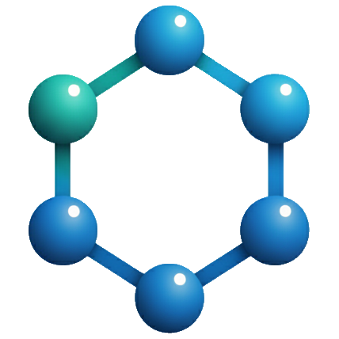

<div align="center">
    <h1>JAFF</h1>
    <br>
    (Just Another Fancy Format)
    <br><br>
</div>

An astrochemical network parser that supports multiple reaction network formats including KIDA, UDFA, PRIZMO, KROME, and UCLCHEM.

For detailed instructons, please refer to the [Documentation](https://jaff-chemistry.github.io/jaff/)

## Installation

### From source

```bash
git clone https://github.com/tgrassi/jaff.git
cd jaff
pip install .
```

### For development

```bash
git clone https://github.com/tgrassi/jaff.git
cd jaff
pip install -e .  # Editable install
```

## Quick Start

### Command Line Usage

After installation, you can use the `jaff` command:

```bash
# Load and validate a network file
jaff networks/gas_reactions_kida.uva.2024.in

# List all species and reactions
jaff networks/test.dat --list-species --list-reactions
```

### Python API Usage

```python
from jaff import Network

# Load a chemical network
network = Network("networks/react_COthin")

# Access species
for species in network.species:
    print(f"{species.name}: mass={species.mass}, charge={species.charge}")

# Access reactions
for reaction in network.reactions:
    print(f"{reaction.get_sympy()}")
```

## Features

- **Multi-format support**: Automatically detects and parses KIDA, UDFA, PRIZMO, KROME, and UCLCHEM formats
- **Validation**: Checks for mass and charge conservation in reactions
- **Species analysis**: Automatic extraction of elemental composition and properties
- **Rate calculations**: Temperature-dependent rate coefficient evaluation
- **ODE generation**: Creates differential equations for chemical kinetics

## Supported Network Formats

- **KIDA**: Kinetic Database for Astrochemistry format
  Reference: [A&A, 689, A63 (2024)](https://doi.org/10.1051/0004-6361/202450606)
- **UDFA**: UMIST Database for Astrochemistry format
  Reference: [A&A, 682, A109 (2024)](https://doi.org/10.1051/0004-6361/202346908)
- **PRIZMO**: Uses `->` separator with `VARIABLES{}` blocks
  Reference:[MNRAS 494, 4471–4491 (2020)](https://doi.org/10.1093/mnras/staa971)
- **KROME**: Comma-separated values with `@format:` header
  Reference: [MNRAS 439, 2386–2419 (2014)](https://doi.org/10.1093/mnras/stu114)
- **UCLCHEM**: Comma-separated with `,NAN,` marker (UNDER CONSTRUCTION)  
   Reference: [J. Holdship et al 2017 AJ 154 38](https://doi.org/10.3847/1538-3881/aa773f)

## Primitive Variables

The following variables are recognized in rate expressions:

- `tgas`: gas temperature, K
- `av`: visual extinction, Draine units
- `crate`: cosmic rays ionization rate of H2, 1/s
- `ntot`: total number density, 1/cm3
- `hnuclei`: H nuclei number density, 1/cm3
- `d2g`: dust-to-gas mass ratio

## Examples

Example network files can be found in the `networks/` directory.

## Development

To contribute or modify JAFF:

```bash
# Install in development mode with dev dependencies
pip install -e ".[dev]"

# Run tests
pytest

# Format code
ruff format

# Lint code
ruff check src/jaff

# Organize imports
ruff check --select I --fix
```

## JAFF Schema Validation

JAFF network exports are JSON payloads serialized to `.jaff` (optionally gzip-compressed as `.jaff.gz`).
To validate a decompressed payload against the schema:

```bash
check-jsonschema --schemafile jaff.network.schema.json test.jaff
```

---


