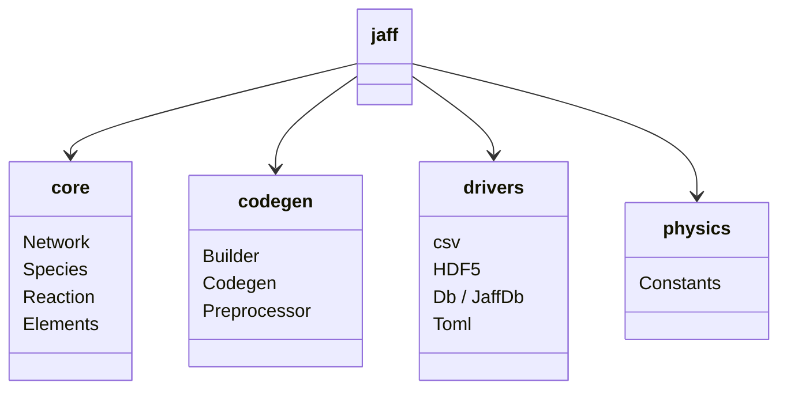

---
tags:
    - Api
    - Introduction
icon: phosphor/code
---

# API Reference

This is a complete reference for all public APIs in JAFF.

## Subpackages

- :phosphor-dna:{ .sm .middle } **Core**

    Primary data-model classes: `Network`, `Species`, `Reaction`, `Elements`.

    [:octicons-arrow-right-24: jaff.core](core/index.md)

- :phosphor-brackets-angle:{ .sm .middle } **Codegen**

    Source code generation from reaction networks: `Builder`, `Codegen`, `Preprocessor`.

    [:octicons-arrow-right-24: jaff.codegen](codegen/index.md)

- :phosphor-database:{ .sm .middle } **Drivers**

    I/O drivers for CSV, HDF5, SQLite, and TOML file formats.

    [:octicons-arrow-right-24: jaff.drivers](drivers/index.md)

- :phosphor-flask:{ .sm .middle } **Physics**

    Physical and astronomical constants in CGS, SI, Gaussian, and natural units.

    [:octicons-arrow-right-24: jaff.physics](physics/index.md)

## Module Overview

JAFF's public API is organized into four subpackages: `core` (network data model), `codegen` (source code generation), `drivers` (file I/O), and `physics` (physical constants).

