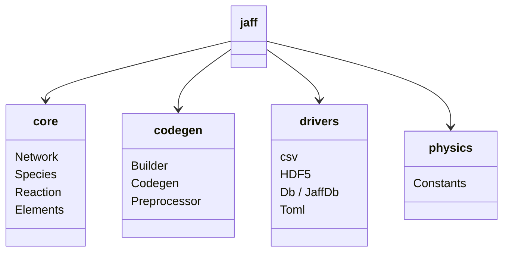

---
tags:
    - Api
    - Introduction
icon: lucide/code
---

# API Reference

This is a complete reference for all public APIs in JAFF.

## Subpackages

- :material-dna:{ .lg .middle } **Core**

    The core modules of JAFF which consists of Network, Species, Reaction, Elements

    [:octicons-arrow-right-24: jaff.core](core/index.md)

- :material-xml:{ .lg .middle } **Codegen**

    The codegeneration layer of JAFF which consists of Builder, Codegen, Preprocessor

    [:octicons-arrow-right-24: jaff.codegen](codegen/index.md)

- :material-database:{ .lg .middle } **Drivers**

    General drivers of JAFF for CSV, HDF5, SQLite, TOML I/O drivers which can be used in general for other purposes

    [:octicons-arrow-right-24: jaff.drivers](drivers/index.md)

- :material-flask:{ .lg .middle } **Physics**

    General physics physical constants in different units which can be used for analysis and other purposes

    [:octicons-arrow-right-24: jaff.physics](physics/index.md)

## Module Overview

The primary modules of jaff are subdivided into four core groups depending on their use. These are the core, codegen (for code generation), drivers, and physics. Although there are a lot more modules, we focus on the ones which are there for public use.

