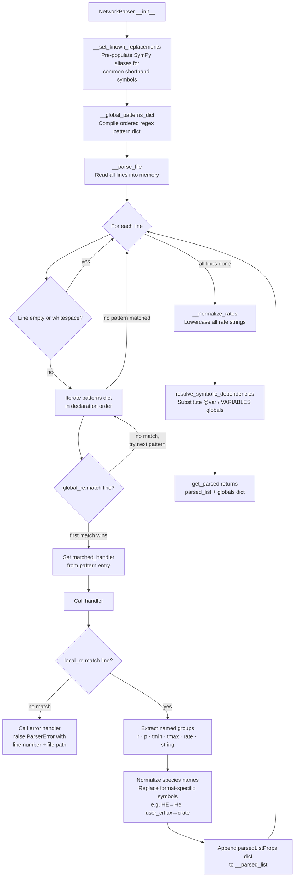

---
tags:
    - Development
icon: phosphor/file-code
---

# Adding a New Network Parser

JAFF's file parser (`NetworkParser` in `src/jaff/core/_network_engine.py`) auto-detects the format of an astrochemical network file and parses each reaction line into a common internal representation. Adding support for a new format requires only two things: a pair of regular expressions and a handler method.

## How the Parser Works

The parser is fully regex-driven. Every line in the network file is tested against an ordered dictionary of patterns. The **first pattern whose `global_re` matches wins**, and its associated handler is called to extract the reaction data.



### The Two-Level Regex Design

Each pattern entry has **two** regexes:

| Field       | Purpose                                                                                                                    |
| ----------- | -------------------------------------------------------------------------------------------------------------------------- |
| `global_re` | Fast, broad filter. Identifies lines that _could_ belong to this format. Matched first.                                    |
| `local_re`  | Detailed extractor. Uses **named groups** to capture every field of the reaction. Matched only after `global_re` succeeds. |

This split keeps the hot path (`global_re`) cheap, while `local_re` does the heavy structural matching and populates the named groups the handler reads.

### The Parsed Reaction Dict

Every handler must append a `parsedListProps` dict with exactly these keys:

| Key        | Type            | Description                                         |
| ---------- | --------------- | --------------------------------------------------- |
| `"r"`      | `list[str]`     | Reactant name strings                               |
| `"p"`      | `list[str]`     | Product name strings                                |
| `"tmin"`   | `float or None` | Lower temperature bound in Kelvin, or `None`        |
| `"tmax"`   | `float or None` | Upper temperature bound in Kelvin, or `None`        |
| `"rate"`   | `str`           | Rate expression as a Python/SymPy-compatible string |
| `"string"` | `str`           | Original network-file line (for error reporting)    |

After all lines are parsed, `__normalize_rates` lower-cases every `"rate"` string, and `resolve_symbolic_dependencies` substitutes any global variables (e.g. from `@var` or `VARIABLES` blocks) into the expressions.

---

## Step-by-Step: Adding a New Format

### 1. Add an entry to `__global_patterns_dict`

Open `src/jaff/core/_network_engine.py` and locate the `__global_patterns_dict` method (line 772). Add your format's entry to the `patterns` dict **in the correct position** — order is critical because the first matching pattern wins.

```python
"my_format": {
    "global_re": r"^(?!\s*[!#@]).*\|.*$",   # (1)
    "local_re": (
        r"^\s*"
        r"(?P<reactants>[^|]+)"
        r"\s*\|\s*"
        r"(?P<products>[^|]+)"
        r"\s*\|\s*"
        r"(?P<tmin>[^|]*)"
        r"\s*\|\s*"
        r"(?P<tmax>[^|]*)"
        r"\s*\|\s*"
        r"(?P<rate>.*?)"
        r"\s*$"
    ),                                        # (2)
    "handler": self.__handle_my_format,       # (3)
},
```

1. **`global_re`** — match any non-comment line that contains `|`. Keep it broad and fast.
2. **`local_re`** — use named groups (`?P<name>`) to capture every field. Named groups map directly to `#!python match.group("name")` calls in your handler.
3. **`handler`** — the private method you will write in the next step.

<!-- prettier-ignore -->
!!! warning "Order matters"
    The patterns dict is iterated sequentially. Place your format **before** any pattern whose `global_re` would also match your format's lines, and **after** any format that should take priority. The existing order is:

    `krome_format` → `krome_var` → `prizmo_vars` → `prizmo` → `udfa` → `krome` → `uclchem` → `kida`

    Formats with more specific `global_re` patterns (e.g. `krome_format` matches only `@format:` lines) should come before broader ones.

---

### 2. Write the handler method

The handler extracts fields from `local_re` and appends to `self.__parsed_list`. Follow the pattern used by existing handlers:

```python
def __handle_my_format(self) -> None:
    assert self.__local_pattern is not None
    match = self.__local_pattern.match(self.__line)
    if not match:
        self.__handle_my_format_errors()

    reactants: str = match.group("reactants")
    products: str = match.group("products")
    tmin_str: str = match.group("tmin").strip()
    tmax_str: str = match.group("tmax").strip()
    rate: str = match.group("rate").strip()

    # Split and normalize species lists
    rr: list[str] = [r.strip() for r in reactants.split("+") if r.strip()]
    pp: list[str] = [p.strip() for p in products.split("+") if p.strip()]

    # Parse temperature bounds — return None when absent or out of range
    t_min: float | None = float(tmin_str) if tmin_str else None
    t_max: float | None = float(tmax_str) if tmax_str else None

    # Replace any format-specific symbols with JAFF canonical names
    rate = rate.replace("my_crflux", "crate").replace("my_av", "av")

    self.__parsed_list.append(
        {
            "r": rr,
            "p": pp,
            "tmin": t_min,
            "tmax": t_max,
            "rate": rate,
            "string": self.__line.strip(),
        }
    )
```

---

### 3. Write the error handler

When `local_re` fails to match a line that `global_re` accepted, `__raise_error` is called with a descriptive message. The error handler inspects whatever the `global_re` _did_ capture to give a precise error:

```python
def __handle_my_format_errors(self) -> None:
    self.__raise_error("Invalid MY_FORMAT reaction detected")
```

For richer diagnostics, inspect the `global_re` match groups (stored as `self.__matched_group`) to pinpoint _why_ the line is malformed — see `__handle_krome_format_errors` (line 197) for a detailed example.

---

## Known Symbol Replacements

After all lines are parsed, `__normalize_rates` lowercases every rate string. The `__set_known_replacements` method (line 743) pre-populates `self.__globals` with SymPy aliases for common shorthand symbols found in KROME/PRIZMO files:

| Shorthand    | Canonical expansion   |
| ------------ | --------------------- |
| `t32`        | `tgas/3e2`            |
| `te`         | `tgas*8.617343e-5`    |
| `invt32`     | `1e0 / t32`           |
| `invte`      | `1e0 / te`            |
| `invtgas`    | `1e0 / tgas`          |
| `sqrtgas`    | `#!python sqrt(tgas)` |
| `user_tdust` | `tdust`               |
| `user_av`    | `av`                  |

If your format introduces additional shorthand symbols, add them to `__set_known_replacements` following the same pattern. Compound aliases (those that reference simpler ones) must be listed **before** the simpler aliases they depend on so that `resolve_symbolic_dependencies` substitutes correctly.

---

## Checklist

- [x] `global_re` placed at the correct position in `__global_patterns_dict`
- [x] `local_re` uses named groups for all fields (`reactants`, `products`, `tmin`, `tmax`, `rate`)
- [x] Handler appends a valid `parsedListProps` dict with all six keys
- [x] Error handler calls `self.__raise_error` with a descriptive message
- [x] Format-specific symbols replaced with JAFF canonical names in the handler or via `__set_known_replacements`
- [x] Tests added in `tests/` with at least one valid reaction line and one malformed line

## See Also

- [Contributing Guide](contributing.md)
- [Code Style Guide](code-style.md)
- [Testing Guide](testing.md)
