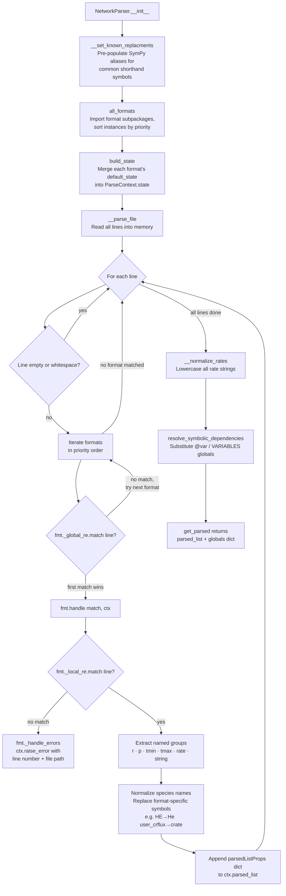

---
tags:
    - Development
icon: phosphor/file-code
---

# Adding a New Network Parser

JAFF's file parser (`NetworkParser` in `src/jaff/core/parsers/network/_engine.py`) auto-detects the format of an astrochemical network file and parses each reaction line into a common internal representation. Each supported format is a self-contained **plugin**: a `NetworkFormat` subclass that lives in its own subpackage under `core/parsers/network/_formats/`. Adding a new format means adding one subpackage — the engine and the existing formats are never touched.

## How the Parser Works

`NetworkParser` discovers every registered format through `all_formats()` and sorts them by their declared `priority` (lower is matched first — **not** file or import order). For each non-blank line, it walks the formats in priority order; the **first format whose `_global_re` matches wins**, and its `handle()` method extracts the reaction data and appends it to the shared `ParseContext`.



### The `NetworkFormat` contract

Every format subclasses `NetworkFormat` (`_formats/_base.py`) and implements:

| Member                  | Purpose                                                                                              |
| ----------------------- | ---------------------------------------------------------------------------------------------------- |
| `priority: int`         | Match order. Lower is tried first. Use the gap-spaced scheme below so new formats slot in cleanly.   |
| `name: str`             | Unique format identifier.                                                                            |
| `state_key: str`        | Namespace into `ParseContext.state` for mutable per-format props. `""` (default) means no state.     |
| `default_state()`       | Initial props for `state_key`, merged once at construction. Override only if the format keeps state. |
| `_global_re(ctx)`       | Fast, broad filter. Identifies lines that _could_ belong to this format. Matched first.              |
| `_local_re(ctx)`        | Detailed extractor. Uses **named groups** to capture every field. Matched inside `handle`.           |
| `handle(match, ctx)`    | Process a matched line, mutating `ctx` (append a reaction and/or update state).                      |

`_global_re` / `_local_re` take `ctx` so the regex can depend on live parse state (KROME rebuilds its `_local_re` from the column counts a `@format:` header wrote). When a pattern is static, compile it once with `@cache`.

### The Two-Level Regex Design

| Field        | Purpose                                                                                                                    |
| ------------ | -------------------------------------------------------------------------------------------------------------------------- |
| `_global_re` | Fast, broad filter. Identifies lines that _could_ belong to this format. Matched first.                                    |
| `_local_re`  | Detailed extractor. Uses **named groups** to capture every field of the reaction. Matched only after `_global_re` succeeds.|

This split keeps the hot path (`_global_re`) cheap, while `_local_re` does the heavy structural matching and populates the named groups the handler reads. The `handle` method receives the **global** match (useful for error diagnostics) and recomputes the local match itself.

### The Parsed Reaction Dict

Every handler appends a `parsedListProps` dict (defined in `core/parsers/network/_typing/`) to `ctx.parsed_list`, with exactly these keys:

| Key        | Type            | Description                                         |
| ---------- | --------------- | --------------------------------------------------- |
| `"r"`      | `list[str]`     | Reactant name strings                               |
| `"p"`      | `list[str]`     | Product name strings                                |
| `"tmin"`   | `float or None` | Lower temperature bound in Kelvin, or `None`        |
| `"tmax"`   | `float or None` | Upper temperature bound in Kelvin, or `None`        |
| `"rate"`   | `str`           | Rate expression as a Python/SymPy-compatible string |
| `"string"` | `str`           | Original network-file line (for error reporting)    |

After all lines are parsed, `__normalize_rates` lower-cases every `"rate"` string, and `resolve_symbolic_dependencies` substitutes any global variables (e.g. from `@var` or `VARIABLES` blocks) into the expressions.

---

## Step-by-Step: Adding a New Format

### 1. Create the format subpackage

Add a folder under `src/jaff/core/parsers/network/_formats/`, e.g. `my_format/`, with a `reaction.py` module. Multi-line-type formats (like KROME's `@format:` header, `@var:`, and reaction lines) get one module per line type — see `krome/` (`header.py`, `var.py`, `reaction.py`).

```python title="_formats/my_format/reaction.py"
import re
from functools import cache

from .. import register
from .._base import NetworkFormat
from .._context import ParseContext


@register
class MyFormatReaction(NetworkFormat):
    """My pipe-delimited reaction line."""

    priority = 55
    name = "my_format"

    @cache
    def _global_re(self, ctx: ParseContext) -> re.Pattern:  # (1)
        return re.compile(r"^(?!\s*[!#@]).*\|.*$")

    @cache
    def _local_re(self, ctx: ParseContext) -> re.Pattern:   # (2)
        return re.compile(
            r"^\s*"
            r"(?P<reactants>[^|]+)\s*\|\s*"
            r"(?P<products>[^|]+)\s*\|\s*"
            r"(?P<tmin>[^|]*)\s*\|\s*"
            r"(?P<tmax>[^|]*)\s*\|\s*"
            r"(?P<rate>.*?)\s*$"
        )

    def handle(self, match: re.Match, ctx: ParseContext) -> None:  # (3)
        local = self._local_re(ctx).match(ctx.line)
        if not local:
            self._handle_errors(match, ctx)

        rr = [r.strip() for r in local.group("reactants").split("+") if r.strip()]
        pp = [p.strip() for p in local.group("products").split("+") if p.strip()]

        tmin_str = local.group("tmin").strip()
        tmax_str = local.group("tmax").strip()
        t_min = float(tmin_str) if tmin_str else None
        t_max = float(tmax_str) if tmax_str else None

        # Replace any format-specific symbols with JAFF canonical names
        rate = local.group("rate").strip().replace("my_crflux", "crate")

        ctx.parsed_list.append(
            {
                "r": rr,
                "p": pp,
                "tmin": t_min,
                "tmax": t_max,
                "rate": rate,
                "string": ctx.line.strip(),
            }
        )

    def _handle_errors(self, match: re.Match, ctx: ParseContext) -> None:
        ctx.raise_error("Invalid MY_FORMAT reaction detected")
```

1. **`_global_re`** — match any non-comment line that contains `|`. Keep it broad and fast. `@cache` because it does not depend on parse state.
2. **`_local_re`** — use named groups (`?P<name>`) to capture every field. Named groups map directly to `#!python local.group("name")` calls in your handler.
3. **`handle`** — receives the global match; recomputes the local match, extracts fields, and appends to `ctx.parsed_list`. Use `ctx.raise_error`, `ctx.globals`, `ctx.logger`, `ctx.line`, and `ctx.nline` instead of instance state — the engine owns no per-line state.

!!! warning "Choosing `priority`"
    Formats are matched in ascending `priority`. Place your format **before** any format whose `_global_re` would also match your lines, and **after** any that should take precedence. The existing order (gap-spaced so you can insert between any two without renumbering):

    | priority | format        |
    | -------- | ------------- |
    | 10       | `krome_format` (`@format:` header) |
    | 20       | `krome_var` (`@var:`)              |
    | 30       | `prizmo_vars` (`VARIABLES { }`)    |
    | 40       | `prizmo`                          |
    | 50       | `udfa`                            |
    | 60       | `krome` (reaction)                |
    | 70       | `uclchem`                         |
    | 80       | `kida`                            |

    Formats with more specific `_global_re` patterns (e.g. `krome_format` matches only `@format:` lines) should get a lower number than broader ones.

---

### 2. Export and register the format

Add the subpackage's `__init__.py` so the class is imported (which runs its `@register` decorator):

```python title="_formats/my_format/__init__.py"
from .reaction import MyFormatReaction

__all__ = ["MyFormatReaction"]
```

Then add the subpackage to the import line inside `all_formats()` in `_formats/__init__.py` so registration is triggered:

```python title="_formats/__init__.py"
def all_formats() -> list[NetworkFormat]:
    from . import kida, krome, my_format, prizmo, uclchem, udfa  # noqa: F401

    return sorted((cls() for cls in _REGISTRY), key=lambda fmt: fmt.priority)
```

That is the only shared file you edit — registration is by `priority`, not import order, so the position in this line does not matter.

---

### 3. (Optional) Share live state across line types

If your format has a header line that configures later reaction lines (like KROME's `@format:`), give both classes the **same** `state_key` and let the header seed it via `default_state()`:

```python
@register
class MyHeader(NetworkFormat):
    priority = 15
    name = "my_header"
    state_key = "my_format"           # shared namespace

    def default_state(self) -> dict:
        return {"ncols": 0}

    def handle(self, match, ctx):
        self.state(ctx)["ncols"] = ... # header writes shared state


@register
class MyFormatReaction(NetworkFormat):
    priority = 55
    name = "my_format"
    state_key = "my_format"           # same key → same dict

    def _local_re(self, ctx):
        ncols = self.state(ctx)["ncols"]  # reaction reads live state
        ...
```

`build_state()` merges every format's `default_state()` into `ParseContext.state[state_key]`, and `self.state(ctx)` returns that live dict. A regex that reads state (like the reaction's `_local_re` above) must **not** be `@cache`d — it has to recompile when the state changes.

---

## Known Symbol Replacements

After all lines are parsed, `__normalize_rates` lowercases every rate string. The `__set_known_replacments` method in `core/parsers/network/_engine.py` pre-populates `self.__globals` with SymPy aliases for common shorthand symbols found in KROME/PRIZMO files:

| Shorthand    | Canonical expansion   |
| ------------ | --------------------- |
| `t32`        | `tgas/3e2`            |
| `te`         | `tgas*8.617343e-5`    |
| `invt32`     | `1e0 / t32`           |
| `invte`      | `1e0 / te`            |
| `invtgas`    | `1e0 / tgas`          |
| `sqrtgas`    | `#!python sqrt(tgas)` |
| `user_tdust` | `tdust`               |
| `user_av`    | `av`                  |

If your format introduces additional shorthand symbols, add them to `__set_known_replacments` following the same pattern. Compound aliases (those that reference simpler ones) must be listed **before** the simpler aliases they depend on so that `resolve_symbolic_dependencies` substitutes correctly.

---

## Checklist

- [x] New subpackage under `core/parsers/network/_formats/` with a `@register`-ed `NetworkFormat` subclass
- [x] `priority` chosen so the format matches at the correct point relative to others
- [x] `_global_re` is a fast filter; `_local_re` uses named groups for all fields (`reactants`, `products`, `tmin`, `tmax`, `rate`)
- [x] Static regexes are `@cache`d; any state-dependent `_local_re` is left uncached
- [x] `handle` appends a valid `parsedListProps` dict (all six keys) to `ctx.parsed_list`
- [x] `_handle_errors` calls `ctx.raise_error` with a descriptive message
- [x] Subpackage added to the `from . import …` line in `_formats/__init__.py`
- [x] Format-specific symbols replaced with JAFF canonical names in the handler or via `__set_known_replacments`
- [x] Tests added in `tests/` with at least one valid reaction line and one malformed line

## See Also

- [Contributing Guide](contributing.md)
- [Code Style Guide](code-style.md)
- [Testing Guide](testing.md)
