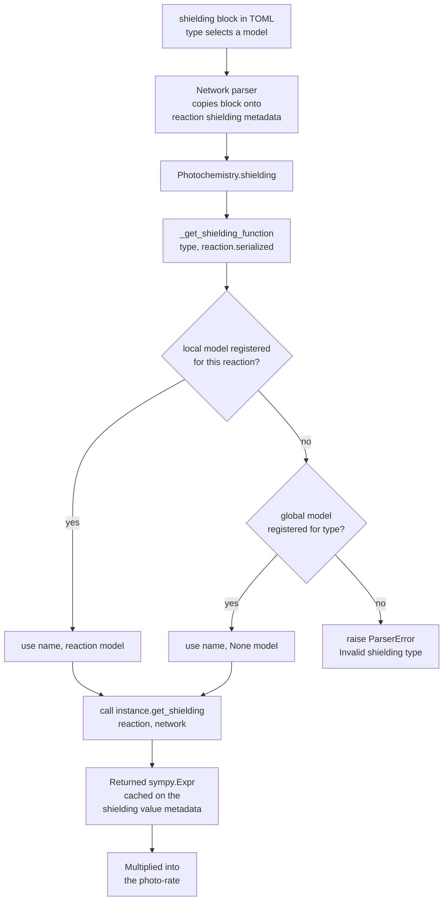

---
tags:
    - Development
icon: phosphor/sun
---

# Adding a Custom Shielding Function

A photo-reaction can attenuate its rate by a dimensionless **shielding factor**
`S`. JAFF resolves that factor from a **registry** of shielding models: each
model is a [`ShieldingFunction`](#the-shieldingfunction-contract) subclass that
registers itself with the `@_register` decorator and exposes a `get_shielding`
method returning a [SymPy](https://www.sympy.org) expression, which is
multiplied into the photo-rate. Adding a new model means writing one such class
and dropping it under `physics/photo_reactions/shielding/`.

There are two flavours, distinguished by the class's `reaction` attribute:

| Flavour    | Scope                        | `reaction` attr            | Location                                                       |
| ---------- | ---------------------------- | -------------------------- | -------------------------------------------------------------- |
| **Local**  | A single reaction            | the serialized reaction    | `shielding/<sanitized_reaction>/<type>.py`                     |
| **Global** | Any reaction that selects it | `None`                     | `shielding/global_/<type>.py`                                  |

In both cases the class's `name` attribute is the keyword a reaction selects via
the TOML `shielding.type` option (matched case-insensitively).

## How Shielding Is Resolved

When a reaction carries a `[reaction."<serialized>".shielding]` block, the
network parser copies it onto `reaction.metadata["shielding"]`, and
`Photochemistry.shielding` (`src/jaff/physics/photo_reactions/_photochemistry.py`)
asks the registry for the model named by `type`. Lookup is keyed by
`(name, reaction.serialized)` and prefers a reaction-specific (local) model,
falling back to a global one registered with `reaction = None`. The resolved
instance's `get_shielding` method is called; the returned expression is cached
on `reaction.metadata["shielding"]["value"]` and folded into the rate.



The registry is populated by importing every (non-underscore) module under
`shielding/`, which runs the `@_register` decorators — so a new model is
discovered automatically once its file is in place; no central list to edit.

<!-- prettier-ignore -->
!!! note "Case-insensitive matching"
    The `shielding.type` string is lower-cased when copied onto the reaction
    metadata, and the registry lower-cases the `name` it matches against. So
    `type = "HG2015"`, `type = "hg2015"`, and a class with `name = "hg2015"` all
    refer to the same model. Pick a lower-case `name` to avoid surprises.

## The `ShieldingFunction` Contract

Every shielding model — local or global — subclasses `ShieldingFunction`
(`shielding/_base.py`), sets two class attributes, and implements one method:

```python
from sympy import Expr

from jaff.physics.photo_reactions.shielding import _register
from jaff.physics.photo_reactions.shielding._base import ShieldingFunction


@_register
class MyModel(ShieldingFunction):
    name = "my_model"          # the shielding.type keyword (lower-case)
    reaction = None            # None = global; a serialized reaction = local

    def get_shielding(self, reaction, network) -> Expr:
        ...
        return shielding_expr
```

| Member             | Purpose                                                                                          |
| ------------------ | ------------------------------------------------------------------------------------------------ |
| `name`             | Shielding-type identifier, matched case-insensitively against `shielding.type`.                  |
| `reaction`         | Serialized reaction this model is bound to (local), or `None` for a global model.                |
| `get_shielding`    | Returns the dimensionless `sympy.Expr`. Read model params off `reaction.metadata["shielding"]`.  |

The returned `Expr` may reference free symbols the code generator resolves at
runtime, by convention:

| Symbol           | Meaning                                              |
| ---------------- | ---------------------------------------------------- |
| `ncol_<species>` | Column density of `<species>` (cm⁻²), e.g. `ncol_H2` |
| `vdisp`          | Velocity dispersion (cm s⁻¹)                         |

The `shielding` block from the TOML is available verbatim (lower-cased strings)
on `reaction.metadata["shielding"]`, so any extra option you add — floors,
tolerances, a radiation-field selector — is read straight from there. **Validate
your inputs** and raise `jaff.errors.ParserError` with a reaction-tagged message
on bad values; the existing models all do this.

## Writing a Local Shielding Function

A local model is bound to one reaction via its `reaction` attribute, set to that
reaction's **serialized** form. Serialisation joins the species on each side
with `.` and separates the two sides with `__`, and photo-reactions carry the
`_PHOTON` agent. For example, `H2 + _PHOTON -> H + H` serialises to
`H2._PHOTON__H.H`.

Because a serialized key contains characters that are illegal in a Python
package name (`.`, `+`, `-`), local models live in a folder whose name is the
**sanitised** serialized key — `.` → `_`, `+` → `j`, `-` → `k`. So
`H2._PHOTON__H.H` lives under `H2__PHOTON__H_H/`. The folder name is only a
filesystem container; the binding comes from the `reaction` class attribute,
which holds the real (unsanitised) serialized string.

```text
physics/photo_reactions/shielding/
└── H2__PHOTON__H_H/         # sanitized folder for H2._PHOTON__H.H
    ├── __init__.py
    ├── hg2015.py            # name = "hg2015"
    ├── db1996.py            # name = "db1996"
    └── _utils/              # shared helpers (leading "_" → not imported as a model)
        ├── __init__.py
        └── db_shielding_function.py
```

A reaction selects one of them (note the **quoted** dotted key — TOML would
otherwise read the dots as nested tables):

```toml
[reaction."H2._PHOTON__H.H".shielding]
type = "hg2015"
min_vdisp = 1.0e-20
min_ncol  = 1.0e-35
```

The model reads its options off the metadata, validates them, and returns the
expression. Following `H2__PHOTON__H_H/hg2015.py`:

```python
"""
H2 shielding by Hartwig et al. 2015
DOI: https://doi.org/10.1093/mnras/stv1368
"""

from typing import Any

from sympy import Expr

from jaff.errors import ParserError
from jaff.physics.photo_reactions.shielding import _register
from jaff.physics.photo_reactions.shielding._base import ShieldingFunction

from ._utils import shielding


@_register
class HG2015(ShieldingFunction):
    """Hartwig et al. (2015) H2 self-shielding (``shielding.type = "hg2015"``)."""

    name = "hg2015"
    reaction = "H2._PHOTON__H.H"

    def get_shielding(self, reaction, network) -> Expr:
        sprops: dict[str, Any] = reaction.metadata["shielding"]
        if "min_ncol" in sprops and not isinstance(sprops["min_ncol"], (float, int)):
            raise ParserError(
                f"Minimum column density must be a float or int for: {reaction}"
            )
        if "min_vdisp" in sprops and not isinstance(sprops["min_vdisp"], (float, int)):
            raise ParserError(
                f"Minimum velocity dispersion must be a float or int for: {reaction}"
            )

        return shielding(
            alpha=1.1,
            min_ncol=sprops.get("min_ncol", 1e-50),
            min_vdisp=sprops.get("min_vdisp", 1e-50),
        )
```

<!-- prettier-ignore -->
!!! tip "Share maths between models"
    When several models in a folder differ only by a parameter (here `db1996.py`
    and `hg2015.py` differ only in `alpha`), put the actual expression builder
    in an underscore-prefixed helper package (`_utils/`). Files and folders
    whose name starts with `_` are **not** imported as selectable models, so
    they make natural homes for shared code.

## Writing a Global Shielding Function

A global model sets `reaction = None` and lives in `shielding/global_/`. It is
available to **any** reaction whose `type` matches its `name`; it derives
everything it needs from the reaction passed to `get_shielding` rather than being
bound to one reaction.

```text
physics/photo_reactions/shielding/
├── global_/
│   ├── __init__.py
│   └── leiden.py           # name = "leiden", reaction = None
└── H2__PHOTON__H_H/
    └── ...
```

```toml
[reaction."CO._PHOTON__C.O".shielding]
type = "leiden"
radiation = "ISRF"
shielded_by = ["self", "H2"]
```

```python
@_register
class Leiden(ShieldingFunction):
    name = "leiden"
    reaction = None             # global — usable by any photo-reaction

    def get_shielding(self, reaction, network) -> Expr:
        ...
```

See `shielding/global_/leiden.py` for a full example that builds one
interpolation call per shielding species.

## Checklist

- [x] Class subclasses `ShieldingFunction` and is decorated with `@_register`
- [x] `name` (lower-case) equals the TOML `shielding.type` keyword
- [x] `reaction` set to the serialized reaction (local) or left `None` (global)
- [x] Local model placed under the **sanitised** folder
      (`shielding/<sanitized_reaction>/<type>.py`); global under `shielding/global_/`
- [x] Implements `get_shielding(self, reaction, network) -> sympy.Expr`
- [x] Reads model options from `reaction.metadata["shielding"]`
- [x] Validates inputs and raises `ParserError` (reaction-tagged) on bad values
- [x] Returns a dimensionless expression using the `ncol_<species>` / `vdisp`
      symbol conventions
- [x] Shared maths factored into an underscore-prefixed helper (if reused)

## See Also

- [Contributing Guide](contributing.md)
- [Code Style Guide](code-style.md)
- [Adding a New Network Parser](adding-parsers.md)
