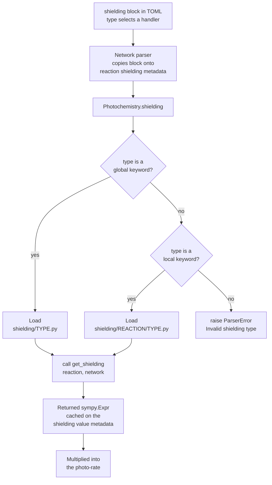

---
tags:
    - Development
icon: phosphor/sun
---

# Adding a Custom Shielding Function

A photo-reaction can attenuate its rate by a dimensionless **shielding factor**
`S`. JAFF resolves that factor by loading a small Python module and calling its
`get_shielding` function, which returns a [SymPy](https://www.sympy.org)
expression that is multiplied into the photo-rate. Adding a new shielding model
means writing one such module and placing it in the right directory.

There are two flavours:

| Flavour    | Scope                        | Location                                                 |
| ---------- | ---------------------------- | -------------------------------------------------------- |
| **Local**  | A single reaction            | `physics/photo_reactions/shielding/<reaction>/<type>.py` |
| **Global** | Any reaction that selects it | `physics/photo_reactions/shielding/<type>.py`            |

In both cases the **file stem is the keyword** a reaction selects via the TOML
`shielding.type` option.

## How Shielding Is Resolved

When a reaction carries a `[reaction.<name>.shielding]` block, the network parser
copies it onto `reaction.metadata["shielding"]` and `Photochemistry.shielding`
(`src/jaff/physics/photo_reactions/_photochemistry.py`) loads the module named by
`type` and calls `get_shielding`. The returned expression is cached on
`reaction.metadata["shielding"]["value"]` and folded into the rate.



<!-- prettier-ignore -->
!!! note "Case-insensitive matching"
    String values in a `shielding` block are lower-cased when copied onto the
    reaction metadata, and file stems are matched lower-cased. So
    `type = "HG2015"`, `type = "hg2015"` and a file named `hg2015.py` all refer
    to the same handler. Pick a lower-case file stem to avoid surprises.

## The `get_shielding` Contract

Every shielding module — local or global — must expose exactly this function:

```python
from sympy import Expr

from ..... import Network, Reaction  # depth depends on the module's location


def get_shielding(reaction: Reaction, network: Network) -> Expr:
    ...
    return shielding_expr
```

| Parameter  | Description                                                                               |
| ---------- | ----------------------------------------------------------------------------------------- |
| `reaction` | The reaction being shielded. Read model parameters from `reaction.metadata["shielding"]`. |
| `network`  | The owning network for property look-ups. Accept it even if unused.                       |

**Return** a dimensionless `sympy.Expr`. It may reference free symbols that the
code generator resolves at runtime, by convention:

| Symbol           | Meaning                                              |
| ---------------- | ---------------------------------------------------- |
| `ncol_<species>` | Column density of `<species>` (cm⁻²), e.g. `ncol_H2` |
| `vdisp`          | Velocity dispersion (cm s⁻¹)                         |

The `shielding` block from the TOML is available verbatim (lower-cased strings)
on `reaction.metadata["shielding"]`, so any extra option you add — floors,
tolerances, a radiation-field selector — is read straight from there. **Validate
your inputs** and raise `jaff.errors.ParserError` with a reaction-tagged message
on bad values; the existing handlers all do this.

## Writing a Local Shielding Function

A local function lives in a folder **named after the serialised reaction** and is
only visible to that reaction. Serialisation joins reactants and products with
`_`, separating the two sides with `__`. For example, `H2 -> H + H` serialises to
`H2__H_H`, so its shielding folder is:

```text
physics/photo_reactions/shielding/
└── H2__H_H/
    ├── hg2015.py        # type = "hg2015"
    ├── db1996.py        # type = "db1996"
    └── _utils/          # shared helpers (leading "_" → not a handler)
        ├── __init__.py
        └── db_shielding_function.py
```

A reaction selects one of them:

```toml
[reaction.H2__H_H.shielding]
type = "hg2015"
min_vdisp = 1.0e-20
min_ncol  = 1.0e-35
```

The handler reads its options off the metadata, validates them, and returns the
expression. Following `H2__H_H/hg2015.py`:

```python
"""
H2 shielding by Hartwig et al. 2015
DOI: https://doi.org/10.1093/mnras/stv1368
"""

from typing import Any

from sympy import Expr

from ..... import Network, Reaction
from .....errors import ParserError
from ._utils import shielding


def get_shielding(reaction: Reaction, network: Network) -> Expr:
    """Return the Hartwig et al. (2015) H2 self-shielding factor."""
    sprops: dict[str, Any] = reaction.metadata["shielding"]
    if "min_ncol" in sprops and not isinstance(sprops["min_ncol"], (float, int)):
        raise ParserError(
            f"Minimum column density must be a float or int for: {reaction}"
        )
    if "min_vdisp" in sprops and not isinstance(sprops["min_vdisp"], (float, int)):
        raise ParserError(
            f"Minimum velocity dispersion must be a float or int for: {reaction}"
        )

    return shielding(
        alpha=1.1,
        min_ncol=sprops.get("min_ncol", 1e-50),
        min_vdisp=sprops.get("min_vdisp", 1e-50),
    )
```

<!-- prettier-ignore -->
!!! tip "Share maths between handlers"
    When several handlers in a folder differ only by a parameter (here
    `db1996.py` and `hg2015.py` differ only in `alpha`), put the actual
    expression builder in an underscore-prefixed helper package (`_utils/`).
    Files and folders whose name starts with `_` are **not** treated as
    selectable handlers, so they make natural homes for shared code.

## Writing a Global Shielding Function

A global function lives directly in the `shielding/` parent folder and is
available to **any** reaction whose `type` matches its stem. The contract is
identical; it simply builds the path from the reaction key itself rather than
being scoped to one folder.

```text
physics/photo_reactions/shielding/
├── leiden.py           # type = "leiden", usable by any reaction
└── H2__H_H/
    └── ...
```

```toml
[reaction.CO__C_O.shielding]
type = "leiden"
radiation = "ISRF"
shielded_by = ["self", "H2"]
```

The handler reads its options the same way and returns an `Expr`. See
`shielding/leiden.py` for a full example that builds one interpolation call per
shielding species.

## Checklist

- [x] Module placed correctly — `shielding/<reaction>/<type>.py` (local) or
      `shielding/<type>.py` (global)
- [x] File stem (lower-case) equals the TOML `shielding.type` keyword
- [x] Exposes `get_shielding(reaction, network) -> sympy.Expr`
- [x] Reads model options from `reaction.metadata["shielding"]`
- [x] Validates inputs and raises `ParserError` (reaction-tagged) on bad values
- [x] Returns a dimensionless expression using the `ncol_<species>` / `vdisp`
      symbol conventions
- [x] Shared maths factored into an underscore-prefixed helper (if reused)

## See Also

- [Contributing Guide](contributing.md)
- [Code Style Guide](code-style.md)
- [Adding a New Network Parser](adding-parsers.md)
