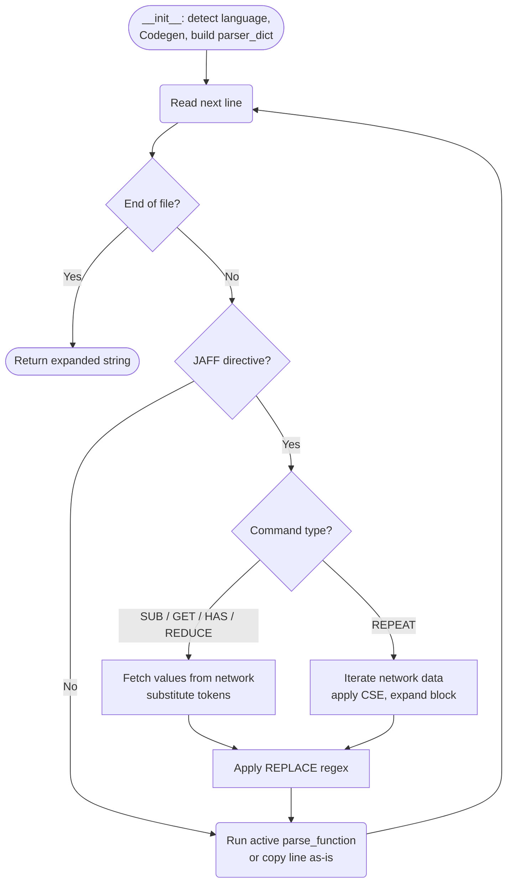

---
tags:
    - Development
icon: lucide/blocks
---

# Adding New Template Properties

JAFF's template engine (`TemplateParser` in `src/jaff/codegen/_template_engine.py`) exposes network data to template files through a single, centrally-defined command dictionary. Adding a new token that templates can reference requires only an entry in that dict — no new parsing logic, no new command types.

## How the Template Engine Works

Template files are processed line-by-line. Lines that contain a `$JAFF` directive (prefixed with the language's comment token) activate a command. Subsequent non-directive lines are handed to that command's active `parse_function` until an `END` directive resets state.



### The Command Dictionary

Everything lives in `__get_parser_dict` (line 1274), a `@cached_property` that builds one dict for the lifetime of the parser:

```python
{
    "SUB":    {"func": self.__sub,    "props": { ... }},
    "REPEAT": {"func": self.__repeat, "props": { ... }},
    "REDUCE": {"func": self.__reduce, "props": { ... }},
    "GET":    {"func": self.__get,    "props": { ... }},
    "HAS":    {"func": self.__has,    "props": { ... }},
    "END":    {"func": self.__end,    "props": {}},
}
```

Each command's `"props"` dict maps **token names** (what template authors write between `$...$`) to a small config dict. The handler (the `"func"` at the command level) reads this dict at runtime. To expose new data, you add an entry to `"props"` — nothing else changes.

---

## Adding a Property to Each Command

### `SUB` — scalar substitution

`SUB` replaces `$token$` with a single value. The prop's `"func"` must be a zero-argument callable that returns the value.

```python
# Template usage:
# // $JAFF SUB my_token
# int N = $my_token$;
# // $JAFF END
```

Add to the `SUB` props dict:

```python
"my_token": {"func": lambda: self.net.my_property},
```

The callable can be any zero-argument function — a lambda, a bound method on `self.net`, or a `Codegen` method:

```python
# Wrap a property
"nspec":   {"func": lambda: self.net.species.count},

# Bind a method directly (Codegen example)
"dedt":    {"func": cg.get_dedt},

# Conditional value
"nbands":  {"func": lambda: self.net.radiation.nbands if self.net.radiation else 0},
```

`SUB` also supports arithmetic in the template (`$my_token+1$`) as long as the returned value is an `int`.

---

### `REPEAT` — iterate over a list

`REPEAT` loops over a list or `IndexedList` and expands a template line for each item. The prop's `"func"` must return the list, and `"vars"` declares which template tokens are available.

```python
# Template usage (vertical — one line per item):
# // $JAFF REPEAT idx, my_item IN my_property
# array[$idx$] = $my_item$;
# // $JAFF END

# Template usage (horizontal — inline array):
# // $JAFF REPEAT my_item IN my_property
# int arr[] = {"$my_item$", };
# // $JAFF END
```

Add to the `REPEAT` props dict:

```python
"my_property": {
    "func": self.net.my_collection.my_method,   # returns list or IndexedList
    "vars": ["idx", "my_item"],                  # vars[0] always "idx", vars[1] = token name
},
```

The handler can be any callable returning a list-like object — an existing network method works directly:

```python
# Reuse existing network method
"species":       {"func": self.net.species.names,    "vars": ["idx", "specie"]},

# Wrap with lambda for arguments
"neutral_indices": {
    "func": lambda: self.net.species.neutral("index"),
    "vars": ["idx", "neutral_index"],
},

# Codegen method returning IndexedList (rate expressions, ODEs, Jacobian, etc.)
"rates": {
    "func": lambda **kwargs: self.cg.get_indexed_rates(**kwargs),
    "vars": ["idx", "rate", "cse"],              # "cse" is a special extra var
},
```

!!! note "Expression-generating props vs list props"
    Props whose `func` returns a plain `list` (species names, charges, masses, etc.) work out of the box. Props whose `func` returns an `IndexedList` (rates, ODEs, Jacobian elements) carry index metadata and support the `$idx$` vertical expansion mode. Both shapes are handled automatically by `__do_iterative_repeat`.

---

### `REDUCE` — aggregate into a sum expression

`REDUCE` builds a sum over all values of a property. The prop's `"func"` returns the list and `"var"` names the single template token used inside the reduction expression `$(...)$`.

```python
# Template usage:
# // $JAFF REDUCE my_var IN my_property
# double total = $($my_var$)$;
# // $JAFF END
# →  double total = 1.0 + 2.0 + 3.0;
```

Add to the `REDUCE` props dict:

```python
"my_property": {
    "func": self.net.my_collection.my_method,  # returns list[float | int]
    "var":  "my_var",                           # token name (singular, not "vars")
},
```

Example:

```python
"specie_masses": {
    "func": self.net.species.masses,
    "var":  "specie_mass",
},
```

---

### `GET` — look up a property for a named entity

`GET` substitutes `$token$` with a value fetched for a specific named entity (a species, reaction, or element). The prop's `"func"` receives the entity name as its only argument.

```python
# Template usage:
# // $JAFF GET my_prop FOR H2
# double val = $my_prop$;
# // $JAFF END
```

Add to the `GET` props dict:

```python
"my_prop": {"func": lambda entity: self.net.species[entity].my_attribute},
```

Examples:

```python
"specie_mass":   {"func": lambda s: self.net.species[s].mass},
"specie_charge": {"func": lambda s: self.net.species[s].charge},
"element_idx":   {"func": lambda e: self.net.elements[e].index},
```

---

### `HAS` — existence check

`HAS` substitutes `$token$` with `1` if the entity exists in the network, `0` otherwise. The prop's `"func"` receives the entity name and must return an `int`.

```python
# Template usage:
# // $JAFF HAS my_type CO
# int has_co = $my_type$;
# // $JAFF END
```

Add to the `HAS` props dict:

```python
"my_type": {"func": lambda entity: int(entity in self.net.my_collection)},
```

Examples:

```python
"specie":   {"func": lambda s: int(s in self.net.species)},
"reaction": {"func": lambda r: int(r in self.net.reactions)},
"element":  {"func": lambda e: int(e in self.net.elements)},
```

---

## Using an External Handler

The callable can be any Python function — it does not need to live on `self.net` or `self.cg`. Pass a module-level function or a method from another object:

```python
from jaff.my_module import compute_my_value

# In __get_parser_dict:
"my_token": {"func": lambda: compute_my_value(self.net)},
```

For `REPEAT`, any function that returns a `list` or `IndexedList` works:

```python
"my_property": {
    "func": lambda: my_external_list_fn(self.net),
    "vars": ["idx", "my_item"],
},
```

---

## Summary

| Command  | `"func"` signature        | Extra key     | What templates get             |
|----------|---------------------------|---------------|-------------------------------|
| `SUB`    | `() → value`              | —             | `$token$`                     |
| `REPEAT` | `(**kwargs) → list`       | `"vars": [...]` | `$idx$`, `$token$` per item |
| `REDUCE` | `() → list[float\|int]`  | `"var": str`  | `$($token$)$` sum expression  |
| `GET`    | `(entity: str) → value`   | —             | `$token$` for named entity    |
| `HAS`    | `(entity: str) → int`     | —             | `$token$` → 0 or 1           |

All existing network accessors (`self.net.species.*`, `self.net.reactions.*`, `self.net.elements.*`) and `Codegen` methods can be wired in directly or via a one-line lambda. No changes to parsing logic are needed.

## See Also

- [Adding a New Network Parser](adding-parsers.md)
- [Template Syntax](../user-guide/code-generation/template-syntax.md)
- [Contributing Guide](contributing.md)
