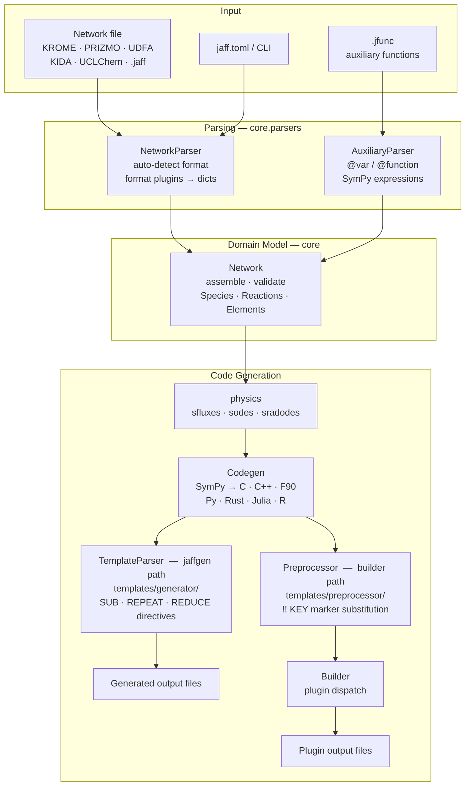

---
tags:
    - Development
icon: phosphor/stack
---

# Codebase Structure

This page maps the `src/jaff` source tree, explains what each package owns, and shows how data flows through the library from a raw network file to generated code.

## Package Map

```
src/jaff/
├── core/                       # Domain model
│   ├── network.py              # Network — main entry point
│   ├── reaction.py             # Reaction + Reactions catalogue
│   ├── species.py              # Specie + Species catalogue
│   ├── elements.py             # Element + Elements catalogue
│   ├── parsers/                # File parsers (network + auxiliary)
│   │   ├── network/            # Multi-format network file parser
│   │   │   ├── _engine.py      # NetworkParser — drives format plugins
│   │   │   ├── _typing/        # parsedListProps, krome/prizmoFormatProps
│   │   │   └── _formats/       # One subpackage per format (plugins)
│   │   │       ├── _base.py    # NetworkFormat ABC (plugin contract)
│   │   │       ├── _context.py # ParseContext — shared per-parse state
│   │   │       ├── __init__.py # register / all_formats / build_state
│   │   │       ├── krome/      # header.py · var.py · reaction.py
│   │   │       ├── prizmo/     # vars.py · reaction.py
│   │   │       ├── udfa/       # reaction.py
│   │   │       ├── uclchem/    # reaction.py
│   │   │       └── kida/       # reaction.py
│   │   └── auxiliary_func/     # .jfunc auxiliary function parser
│   │       ├── _engine.py      # AuxiliaryFunctionParser
│   │       └── _typing/        # AuxiliaryFunctionsDict
│   └── _typing/                # Shared core TypedDicts (Network/Element/Reaction)
│
├── physics/                    # Symbolic ODE/flux generation + physics helpers
│   ├── _equations.py           # get_sfluxes, get_sodes, get_sradodes
│   ├── photo_reactions/        # Photochemistry: cross sections, radiation, shielding
│   │   ├── _photochemistry.py  # get_xsec / get_verner_xsec / shielding — lookups
│   │   ├── _radiation.py       # Radiation moment equations
│   │   ├── _typing/            # TypedDicts (XsecsProps, ...)
│   │   └── shielding/          # Shielding-function registry (@_register, by reaction metadata)
│   │       ├── _base.py        # ShieldingFunction ABC (name, reaction attrs)
│   │       ├── global_/        # Global models, reaction=None (e.g. leiden.py)
│   │       └── H2__PHOTON__H_H/ # Local H2 self-shielding (db1996, hg2015) + shared _utils
│   ├── _typing/                # TypedDicts (Numeric, ...)
│   └── constants.py            # Physical constants (astropy Quantities)
│
├── plotting/                   # Publication-style matplotlib wrapper
│   └── plotter.py              # Plotter — plot / plot_xsec (house rcParams)
│
├── codegen/                    # Code generation pipeline
│   ├── codegen.py              # SymPy → C/C++/Fortran/Python/Rust/Julia/R
│   ├── preprocessor.py         # Template marker substitution
│   ├── builder.py              # Plugin-based orchestration
│   └── _template_engine.py     # JAFF directive rendering
│
├── io/                         # Serialization and logging
│   ├── _io.py                  # .jaff gzip-JSON read/write; data table export
│   └── _logger.py              # JaffLogger + progress bars
│
├── config/                     # Package-wide path constants
│   └── _config.py              # SRC_DIR, DATA_DIR, XSECS/SHIELDING dirs, ...
│
├── drivers/                    # Config / data format adapters
│   ├── toml.py                 # TOML config reader
│   ├── csv.py                  # CSV I/O
│   ├── hdf5.py                 # HDF5 I/O
│   ├── sqlite.py               # SQLite I/O
│   └── pooch.py                # Download/cache remote cross-section data files
│
├── cli/                        # Command-line entry points
│   ├── _jaffgen.py             # jaffgen — template-driven code generation
│   ├── _jaffx.py               # jaffx — network inspection / conversion
│   └── _config_engine.py       # Config resolution: CLI > jaff.toml > defaults
│
├── plugins/                    # Named solver plugins
│   ├── python_solve_ivp/       # SciPy solve_ivp wrapper
│   ├── fortran_dlsodes/        # Fortran DLSODES solver
│   ├── kokkos_ode/             # Kokkos GPU ODE solver
│   └── microphysics/           # AMReX microphysics driver
│
├── templates/                  # Source templates consumed by plugins
│   ├── generator/<name>/       # JAFF directive template files
│   └── preprocessor/<name>/    # Marker substitution templates
│
├── types/                      # Base data structures
│   ├── _catalogue.py           # Catalogue[T] — O(1) list + dict lookup
│   ├── _vector.py              # Typed numeric container
│   ├── _indexed.py             # IndexedList / IndexedValue
│   └── _hdf5.py                # HDF5 type helpers
│
├── common/                     # Shared utilities
│   ├── _helper.py              # Element/mass table loading
│   ├── _integrators.py         # Dependency resolution (DFS)
│   ├── _sympy_json.py          # Versioned SymPy ↔ JSON encoding
│   ├── _fastlog.py             # Fast structured logging
│   └── _welcome.py             # MOTD / version banner
│
├── errors/
│   └── _parser.py              # ParserError hierarchy
│
├── data/                       # Raw data assets
│   ├── atom_mass.csv           # Element mass table (bundled)
│   ├── xsecs/                  # Photo cross-section data (downloaded via drivers/pooch.py, not bundled)
│   │   ├── leiden.hdf5         # Leiden PDR cross sections (one group per reaction)
│   │   ├── norad.hdf5          # NORAD/OP ground-state photoionisation
│   │   └── verner_1996.csv     # Verner (1996) analytic-fit parameters
│   └── shielding/              # Line-shielding tables (downloaded via drivers/pooch.py, not bundled)
│       └── leiden.hdf5         # Leiden line shielding (one group per reaction)
│
├── db/                         # Prebuilt SQLite database
│   └── jaff.db                 # Mass + photo cross-section (Leiden/NORAD + Verner) tables, built from data/
│
└── _utils/                     # Standalone maintenance scripts
    ├── generate_mass_table.py          # Build mass tables in jaff.db from data/atom_mass.csv
    ├── download_nahar_xsecs.py         # Download NORAD/OP ground-state photoionisation .dat files
    ├── collapse_xsecs_hdf5.py          # Merge per-reaction files into leiden.hdf5 / norad.hdf5
    ├── split_xsecs_photodecay.py       # Split source diss/ion datasets into the photodecay channel
    ├── generate_photo_xsecs_table.py   # Build photo_reaction_cross_sections table in jaff.db
    ├── generate_ion_xsecs_table.py     # Build verner_cross_sections table in jaff.db
    └── build_shielding_hdf5.py         # Collapse Leiden shielding tables into shielding/leiden.hdf5
```

## Architecture Diagram



## Data Flow — End to End

The table below traces a single `jaffgen` invocation from command line to output files.

| Step | Component                   | What happens                                                                                       |
| ---- | --------------------------- | -------------------------------------------------------------------------------------------------- |
| 1    | `cli/_jaffgen.py`           | Parse CLI args, read `jaff.toml` via `_config_engine.py`                                           |
| 2    | `core/parsers/network/_engine.py`        | Auto-detect format via registered plugins; convert each reaction line to a `parsedListProps` dict |
| 3    | `core/parsers/auxiliary_func/_engine.py` | Parse `.jfunc` file (if present); resolve `@var`/`@function` blocks into SymPy expressions         |
| 4    | `core/network.py`           | Build `Species`, `Reactions`, `Elements` catalogues; validate duplicates, sinks, isomers           |
| 5    | `physics/_equations.py`     | Compute symbolic fluxes (`sfluxes`) and ODE RHS (`sodes`) using SymPy                              |
| 6    | `codegen/codegen.py`        | Translate SymPy expressions into assignment strings for the chosen language                        |
| 7    | `codegen/preprocessor.py`   | Walk template files; replace `!! PREPROCESS_KEY … !! PREPROCESS_END` blocks with generated strings |
| 8    | `codegen/builder.py`        | Invoke the named plugin's `#!python main()` to write final output files to the build directory     |

## Key Design Decisions

**Plugin-based, format-agnostic parser.**
Each network format is a `NetworkFormat` subclass living in its own subpackage under `core/parsers/network/_formats/`. A class registers itself with the `@register` decorator; `NetworkParser` discovers all formats via `all_formats()`, ordered by each format's `priority` (not file or import order). Every format exposes a fast `_global_re` filter and a detailed `_local_re` extractor, and writes results through a shared `ParseContext`. Adding a new format means adding one subpackage — no edits to the engine or shared code. See [Adding a Parser](adding-parsers.md).

**SymPy as the intermediate representation.**
All rate expressions, fluxes, and ODEs live as SymPy objects inside `Network`. Code generation (`Codegen`) calls SymPy's language-specific printers (`ccode`, `cxxcode`, `fcode`, etc.), so adding a new target language is isolated to `LangModifier` token tables.

**Plugin-based code generation.**
`Builder` discovers plugins at `jaff.plugins.<name>.plugin` and calls their `#!python main()`. Each plugin owns its template files and knows nothing about the parser. This keeps solver-specific logic out of the core library.

**`Catalogue[T]` for all domain collections.**
`Species`, `Reactions`, and `Elements` all inherit from `Catalogue`, giving O(1) lookup by integer index, slice, string name, _and_ serialized canonical name. The serialized form (e.g. `"+/H/H/O"` for H₂O⁺) enables duplicate detection that is independent of input name formatting.

**`.jaff` binary format.**
Networks can be saved as gzip-compressed JSON (`.jaff` files) via `io/_io.py`. On load, SymPy expressions are reconstructed from the versioned compact encoding in `common/_sympy_json.py`. This avoids re-parsing large networks on repeated runs.

## Utility Scripts

`src/jaff/_utils/` holds standalone, easy-to-run scripts for maintaining the bundled data. They are **not** part of the runtime data flow — they are run by hand (or during maintenance) to regenerate the assets in `data/` and `db/jaff.db`.

The cross-section scripts are ordered as a pipeline: download raw NORAD data,
collapse the per-reaction files into combined HDF5 files, then build the
SQLite lookup tables that JAFF queries at runtime.

| Script                          | Purpose                                                                                                                                           |
| ------------------------------- | ------------------------------------------------------------------------------------------------------------------------------------------------- |
| `generate_mass_table.py`        | Read `data/atom_mass.csv` and (re)build the element mass tables inside `db/jaff.db`.                                                              |
| `download_nahar_xsecs.py`       | Download NORAD/OP (Nahar, OSU) ground-state photoionisation cross sections (Z = 1..26) into `data/xsecs/op/` using serialized reaction names.     |
| `collapse_xsecs_hdf5.py`        | Merge the per-reaction Leiden and NORAD files into combined `leiden.hdf5` / `norad.hdf5` (one group per reaction, photon energy in eV, σ in cm²). |
| `split_xsecs_photodecay.py`     | Split the source dissociation/ionisation datasets into the single `photodecay` channel used by the collapsed HDF5 files.                          |
| `generate_photo_xsecs_table.py` | Build the `photo_reaction_cross_sections` table in `db/jaff.db` from the collapsed HDF5 files (`photo_absorption` flag, `decay_type` + `file.hdf5::<group>` pointers). |
| `generate_ion_xsecs_table.py`   | Build the `verner_cross_sections` table in `db/jaff.db` from the Verner (1996) analytic-fit parameters in `data/xsecs/verner_1996.csv`.          |
| `build_shielding_hdf5.py`       | Collapse the per-species Leiden line-shielding tables into `data/shielding/leiden.hdf5` (one group per reaction).                                 |

Run a script as a module from the project root, e.g.:

=== "python"

    ```bash
    python -m jaff._utils.generate_mass_table
    ```

=== "uv"

    ```bash
    uv run python -m jaff._utils.generate_mass_table
    ```
