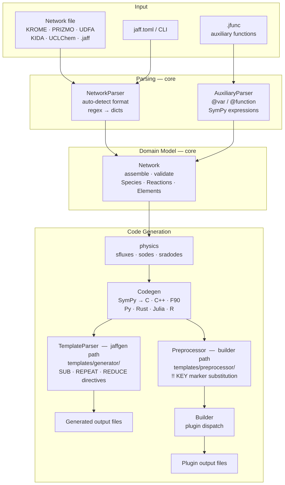

---
tags:
    - Development
icon: phosphor/stack
---

# Codebase Structure

This page maps the `src/jaff` source tree, explains what each package owns, and shows how data flows through the library from a raw network file to generated code.

## Package Map

```
src/jaff/
├── core/                       # Domain model
│   ├── network.py              # Network — main entry point
│   ├── reaction.py             # Reaction + Reactions catalogue
│   ├── species.py              # Specie + Species catalogue
│   ├── elements.py             # Element + Elements catalogue
│   ├── _network_engine.py      # Multi-format network file parser
│   ├── _auxiliary_engine.py    # .jfunc auxiliary function parser
│   └── _typing/                # TypedDicts for all core types
│
├── physics/                    # Symbolic ODE/flux generation
│   ├── _equations.py           # get_sfluxes, get_sodes, get_sradodes
│   ├── _photochemistry.py      # Photoionisation / photodissociation
│   ├── _radiation.py           # Radiation moment equations
│   └── constants.py            # Physical constants (CGS)
│
├── codegen/                    # Code generation pipeline
│   ├── codegen.py              # SymPy → C/C++/Fortran/Python/Rust/Julia/R
│   ├── preprocessor.py         # Template marker substitution
│   ├── builder.py              # Plugin-based orchestration
│   └── _template_engine.py     # JAFF directive rendering
│
├── io/                         # Serialization and logging
│   ├── _io.py                  # .jaff gzip-JSON read/write; data table export
│   └── _logger.py              # JaffLogger + progress bars
│
├── drivers/                    # Config / data format adapters
│   ├── toml.py                 # TOML config reader
│   ├── csv.py                  # CSV I/O
│   ├── hdf5.py                 # HDF5 I/O
│   └── sqlite.py               # SQLite I/O
│
├── cli/                        # Command-line entry points
│   ├── _jaffgen.py             # jaffgen — template-driven code generation
│   ├── _jaffx.py               # jaffx — network inspection / conversion
│   └── _config_engine.py       # Config resolution: CLI > jaff.toml > defaults
│
├── plugins/                    # Named solver plugins
│   ├── python_solve_ivp/       # SciPy solve_ivp wrapper
│   ├── fortran_dlsodes/        # Fortran DLSODES solver
│   ├── kokkos_ode/             # Kokkos GPU ODE solver
│   └── microphysics/           # AMReX microphysics driver
│
├── templates/                  # Source templates consumed by plugins
│   ├── generator/<name>/       # JAFF directive template files
│   └── preprocessor/<name>/    # Marker substitution templates
│
├── types/                      # Base data structures
│   ├── _catalogue.py           # Catalogue[T] — O(1) list + dict lookup
│   ├── _vector.py              # Typed numeric container
│   ├── _indexed.py             # IndexedList / IndexedValue
│   └── _hdf5.py                # HDF5 type helpers
│
├── common/                     # Shared utilities
│   ├── _helper.py              # Element/mass table loading
│   ├── _integrators.py         # Dependency resolution (DFS)
│   ├── _sympy_json.py          # Versioned SymPy ↔ JSON encoding
│   ├── _fastlog.py             # Fast structured logging
│   └── _welcome.py             # MOTD / version banner
│
├── errors/
│   └── _parser.py              # ParserError hierarchy
│
├── data/                       # Bundled raw data assets
│   ├── atom_mass.csv           # Element mass table
│   └── xsecs/                  # Photo cross-section data (Verner fits, .dat tables)
│
├── db/                         # Prebuilt SQLite database
│   └── jaff.db                 # Reaction/species/mass tables, built from data/
│
└── _utils/                     # Standalone maintenance scripts
    ├── generate_mass_table.py        # Build mass tables in jaff.db from data/atom_mass.csv
    └── generate_ion_xsecs_table.py   # Build ion cross-section tables in jaff.db from data/xsecs/
```

## Architecture Diagram



## Data Flow — End to End

The table below traces a single `jaffgen` invocation from command line to output files.

| Step | Component | What happens |
|------|-----------|--------------|
| 1 | `cli/_jaffgen.py` | Parse CLI args, read `jaff.toml` via `_config_engine.py` |
| 2 | `core/_network_engine.py` | Auto-detect format; convert each reaction line to a `parsedListProps` dict |
| 3 | `core/_auxiliary_engine.py` | Parse `.jfunc` file (if present); resolve `@var`/`@function` blocks into SymPy expressions |
| 4 | `core/network.py` | Build `Species`, `Reactions`, `Elements` catalogues; validate duplicates, sinks, isomers |
| 5 | `physics/_equations.py` | Compute symbolic fluxes (`sfluxes`) and ODE RHS (`sodes`) using SymPy |
| 6 | `codegen/codegen.py` | Translate SymPy expressions into assignment strings for the chosen language |
| 7 | `codegen/preprocessor.py` | Walk template files; replace `!! PREPROCESS_KEY … !! PREPROCESS_END` blocks with generated strings |
| 8 | `codegen/builder.py` | Invoke the named plugin's `#!python main()` to write final output files to the build directory |

## Key Design Decisions

**Regex-driven, format-agnostic parser.**
`NetworkParser` uses an ordered dict of `(global_re, local_re, handler)` triples. The fast `global_re` filters candidate lines; `local_re` extracts named groups. Adding a new format means adding one entry — no branching in shared code. See [Adding a Parser](adding-parsers.md).

**SymPy as the intermediate representation.**
All rate expressions, fluxes, and ODEs live as SymPy objects inside `Network`. Code generation (`Codegen`) calls SymPy's language-specific printers (`ccode`, `cxxcode`, `fcode`, etc.), so adding a new target language is isolated to `LangModifier` token tables.

**Plugin-based code generation.**
`Builder` discovers plugins at `jaff.plugins.<name>.plugin` and calls their `#!python main()`. Each plugin owns its template files and knows nothing about the parser. This keeps solver-specific logic out of the core library.

**`Catalogue[T]` for all domain collections.**
`Species`, `Reactions`, and `Elements` all inherit from `Catalogue`, giving O(1) lookup by integer index, slice, string name, *and* serialized canonical name. The serialized form (e.g. `"+/H/H/O"` for H₂O⁺) enables duplicate detection that is independent of input name formatting.

**`.jaff` binary format.**
Networks can be saved as gzip-compressed JSON (`.jaff` files) via `io/_io.py`. On load, SymPy expressions are reconstructed from the versioned compact encoding in `common/_sympy_json.py`. This avoids re-parsing large networks on repeated runs.

## Utility Scripts

`src/jaff/_utils/` holds standalone, easy-to-run scripts for maintaining the bundled data. They are **not** part of the runtime data flow — they are run by hand (or during maintenance) to regenerate the assets in `data/` and `db/jaff.db`.

| Script | Purpose |
|--------|---------|
| `generate_mass_table.py` | Read `data/atom_mass.csv` and (re)build the element mass tables inside `db/jaff.db`. |
| `generate_ion_xsecs_table.py` | Compute photoionisation cross-sections (Verner fits) from `data/xsecs/` and (re)build the cross-section tables in `db/jaff.db`. |

Run a script as a module from the project root, e.g.:

=== "python"

    ```bash
    python -m jaff._utils.generate_mass_table
    ```

=== "uv"

    ```bash
    uv run python -m jaff._utils.generate_mass_table
    ```
